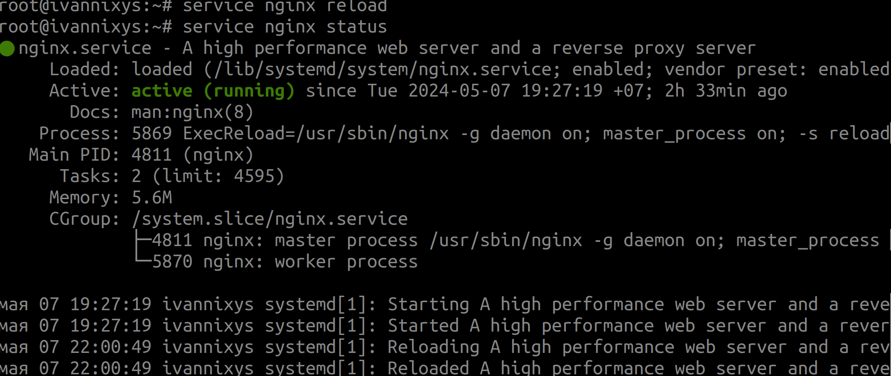
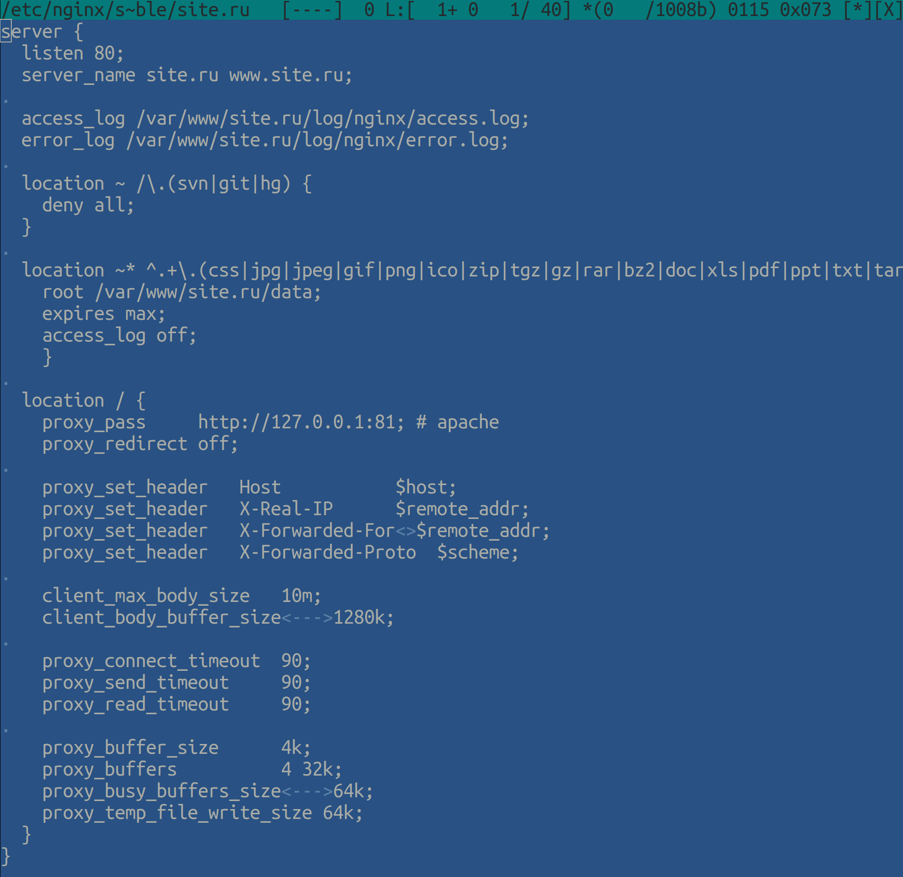

## Part 1. Установка и настройка операционной системы

### 1.1. Установка операционной системы

- Создаем виртуальную машину с именем VM-Nixys с операционной системой Ubuntu server 20.04.6 LTS т.к. данная версия операционной системы стабильная и удобная в работе: 
- При установке операционной системы устанавливаем флаг для установки Open-SSH, чтобы в дальнейшем мы смогли подключиться терминалом физического сервера к серверу виртуальной машины, для удобства работы

### 1.2. Настройка SSH
- В настройках VirtualBox в нашей виртуальной машине в адаптерах ставим Сетевой Мост. Запускаем виртуальную машину. При помощи команды `ip a` узнаем ip-адрес виртуальной машины в нашей сети

- Открываем терминал на физическом сервере и вводим команду ssh `username@ipaddressVM` где username - это имя пользователя виртуальной машины, ipaddressVM - ip-адрес виртуальной машины, который мы узнали при помощи команды `ip a` . Вводим пароль пользователя. Подключение успешно. 

### 1.3. Установка базовых пакетов
- Для начала обновим список пакетов из репозитория при помощи команды `sudo apt-get update`. Здесь мы добавляем ключевое слово sudo, для того чтобы выполнять команды с паролем суперпользователя

- Далее запускаем установку базовых пакетов для создания и работы с площадками сервера при помощи команды `sudo apt-get install dirmngr mc iotop htop telnet tcpdump nmap curl console-cyrillic hexedit sudo zip unzip patch pwgen vim less parted subversion ntp bzip2 lsof strace mutt s-nail ncdu smartmontools tree dnsutils logrotate rsyslog`. Установка прошла успешно. В качестве проверки посмотрим версию некоторых пакетов при помощи команды `program_name --version`, где program_name - имя пакета  

### 1.4. Установка времени, часовых поясов и локалей
- установка времени на сервере при помощи команды `dpkg-reconfigure tzdata`. В режиме обычного пользователя система предупреждает, что данное действие нужно производить из режима суперпользователя

- меняем пароль пользователя root при помощи команды `sudo passwd root` и переходим в него с помощью команды `su -`. Дефис после su нужен для того чтобы все переменные среды были перезагружены для нового пользователя

- повторно вводим команду `dpkg-reconfigure tzdata` под пользователем root и выбираем нужную нам локаль

- вводим команду `dpkg-reconfigure locales`. Выбираем нужные нам локали (RU-UTF8, RU-KOI8R, RU-CP1251). Выбор локалей производится через клавишу __пробел__

- применяем локали при помощи команды `source /etc/default/locale` и проверяем при помощи команды `locale`

- Хорошая работа. Локали настроены и применены 

### 1.5. Установка редактора по умолчанию
- вводим команду `update-alternatives --config editor` и выбираем редактор __mc_edit__ по умолчанию (он четвертый в списке под цифрой 3)

### 1.6. Установка и настройка git-autocommit

- устанавливаем __git__ при помощи команды `apt-get install git`. Мы его установили заранее
- создаем файл конфигурации в корневой директории __root__ пользователя с нужными правами `touch ~/.gitconfig` 
`chmod 600 ~/.gitconfig`

- содержание файла .gitconfig. Заменяем __$HOSTNAME__ на название сервера

- создаем репозиторий при помощи команд `git init && mv .git config.git chmod 700 /root/config.git echo "gitdir: /root/config.git" > /.git && chmod 600 /.git`

- задаем директории, для который автокоммит не должен фиксировать изменения, в файл ~/config.git/info/exclude. Сохраняем

- делаем первый коммит `git add -A && git commit -m 'Создание репозитория @system'`

- реализация постоянного отслеживания установленных пакетов на сервере при помощи __git-autocommit__ для cron. Выполнение задачи каждый час в 00 минут. Сохраняем

- установим пакет __nginx__ и проверим работу автокоммита

- прекрасно. Всё работает как швейцарские часы

## Part2. Настройка Nginx

### 2.1. Настроить сжатие типов данных: text, javascript, css, json, xml

- открываем конфигурационный файл nginx.conf любым текстовым редактором. Редактируем строки начинающиеся с gzip. Уровень сжатия ставим средний между производительностью и степенью сжатия, сжимаем все запросы

### 2.2. Запретить вывод версии Nginx(при web-запросах к сайтам сервера)

- снимаем с комментария строку `server_tokens off;`. Теперь в http-запросе будет указано что веб-сервер работает на nginx, но не будет показывать его версию, что с точки зрения безопасности более привлекательно

### 2.3. Разрешить максимальную загрузку данных через Nginx в соответствии с настройками PHP

- дописываем в конфигурацию nginx строку, которая задает размер запроса не более 64 мегабайт

- не забываем проверить конфигурационный файл на наличие лексических ошибок при помощи команды `nginx -t`

- перезапускаем сервер nginx для принятия изменений и смотрим статус сервиса

## Part 3. Настройка Apache

### 3.1. Настроить работу Apache по 81 порту на локальном ip-адресе

- установим apache2 при помощи команды. После установки сервис apache не запускается, потому что по умолчанию на том же порту, что и nginx

>> apt install apache2 libapache2-mpm-itk

- меняем порт на 81 в конфигурации apache. Сохраняем

- включаем модуль mpm-prefork

- прописываем в конфигурацию префорка данные, сохраняем

- прописываем имя основной площадки

- рестартнем сервис apache. Возникла ошибка! Модуль запускаться не хочет. На момент ошибка неизвестна

- убираем из `mpm-prefork.conf` строки __LimitUIDRange 0 65535__ и __LimitGIDRange 0 65535__. Прослушиваем порты apache и nginx

### 3.2. Уменьшить максимальное количество клиентов веб-сервера до 25

- т.к. у нас используется mpm-prefork, максимальное количество клиентов сервера находится в файле конфигурации префорка `/etc/apache2/mods-enabled/mpm_prefork.conf`. Меняем значение __MaxRequestWorkers__ и сохраняем

### 3.3. Запретить(глобально) возможность обращения пользователей к директориям вида .svn и .git

- заходим в конфигурацию безопасности apache, раскомментируем 3 строки и добавляем git

### 3.4. Донастройка безопасности Apache

- заходим в конфигурацию безопасности apache и меняем указанные строки

- перезагружаем сервис apache2 и смотрим статус работы сервиса

## Part 4. Настройка MySQL

### 4.1. Установка и первоначальная настройка.Выделить для кэша запросов 32 Мб ОЗУ. Размер временных таблиц установить в 50 Мб. Количество кэшированных потоков(нитей) должно быть не ниже 20. Все InnoDB-таблицы должны храниться в отдельных файлах

- добавим ключ репозитория перед установкой 

>> wget -q -O- http://repo.mysql.com/RPM-GPG-KEY-mysql | apt-key add -

- После добавляем нужный репозиторий в пакетный менеджер apt, для этого в конец файла /etc/apt/sources.list дописываем строки вида

`deb http://repo.mysql.com/apt/debian/ buster mysql-5.7`

`deb-src http://repo.mysql.com/apt/debian/ buster mysql-5.7`

- выполняем 

>> apt update

>> apt install mysql-server

- увеличиваем лимит файлов до 8192. Вводим команду `systemctl edit mysql` и вставляем текст
 `[service]`
`LimitNOFILE = 8192` 

- перечитываем лимиты и перезагружаем mysql 

>> systemctl daemon-reload

>> systemctl restart mysql

- вносим изменения в файл `/etc/mysql/my.cnf`

- однако при проверке конфиг файла было обнаружено что строки __query_cache_limit__ и __query_cache_size__ не актуальны и удалены из новой версии MySQL8+. Немного поправим конфигурацию MySQL проверим на ошибки и перезапустим

## Part 5. Настройка PHP

### 5.1. Установка PHP и базовых модулей

- установка пакетов, необходимых для gpg ключа 

>> apt -y install lsb-release apt-transport-https ca-certificates

- Скачиваем ключ репозитория sury и прописываем его в apt 

>> wget -O /etc/apt/trusted.gpg.d/php.gpg https://packages.sury.org/php/apt.gpg

>> echo "deb https://packages.sury.org/php/ $(lsb_release -sc) main" | tee /etc/apt/sources.list.d/php.list`

- устанавливаем PHP и базовые модули

>> apt-get update && apt-get install php7.4 php7.4-cli php7.4-common php7.4-curl php7.4-gd php7.4-geoip php7.4-imagick php7.4-imap php7.4-intl php7.4-mcrypt php7.4-mysql php7.4-apc

- проверяем версию PHP командой `php -v`. Проверяем модули PHP командой `php -m`

> Для просмотра доступных модулей PHP, которые можно установить через apt используется команда `apt-cache search 'php7.4'`. Я ставил версию 8.1. Есть небольшие ньюансы в установке модов. Некоторые моды нельзя поставить пока не поставишь другие. Ставил все моды отдельно.

- Меняем настройки в 2 файлах `/etc/php/8.1/apache2/php.ini` и 
`/etc/php/8.1/cli/php.ini`. Файл php.ini расположенный в apache2 отвечает за настройки PHP используемые при передаче скриптов на обработку Apache2, в нашем случае это будут настройки при использовании площадки клиентами на сайте. Файл php.ini расположенный в cli используется при выполнении скриптов из консоли и крон задач при вызове скриптов через php обработчик. Вносим изменения в строки:

`short_open_tag = Off` меняем на `short_open_tag = On` . Данная директива определяет использование сокращенных тегов для PHP кода

`post_max_size = 8M` меняем на `post_max_size = 128M` . Определяет максимальный размер данных, отправленных на сервер через POST запрос

`upload_max_filesize = 2M` меняем на `upload_max_filesize = 64M`. Максимальный размер загружаемого файла на сервер

`;date.timezone =` меняем на `date.timezone = Europe/Moscow`

`session.gc_probability = 0` меняем на `session.gc_probability = 10`. Вероятность запуска сборщика мусора для старых сессий (от 0 до 100)

`session.gc_divisor = 1000` меняем на `session.gc_divisor = 100`. Используется с предыдущей директивой. Как делимое для него. Частота запуска сборщика мусора

`session.gc_maxlifetime = 1440` меняем на `session.gc_maxlifetime = 86400`. Время, по истечении которого данные будут считаться устаревшими. Это сутки в секундах

- т.к. конфиги PHP довольно объемные, скрины не прилагаю.

- задаем права на директории PHP:

>> chmod -R o-rwx /etc/php/7.4

>> chmod 751 /etc/php/7.4

>> chmod -R o+rX /etc/php/7.4/cli

>> chmod -R o+rX /etc/php/7.4/apache2 

>> chmod -R o+rX /etc/php/7.4/mods-available

- Ставим плюсик себе в карму. Проделана большая работа

***

## Part 6. Настройка первой площадки под сайт

### 6.1. Создание пользователя системы и каталога

- создаём группу пользователей. Здесь `-g 10002` - это GroupID(GID), `site.ru` - имя новой группы

>> groupadd -g 10002 site.ru

- cоздаем нового пользователя. С первым параметром мы уже разобрались. `-u 10002` - это UserID(UID), `-s /bin/bash` - оболочка shell по умолчанию. `-d /var/www/site.ru` - установка домашнего каталога пользователя, `site.ru` - имя пользователя

>> useradd -g 10002 -u 10002 -s /bin/bash -d /var/www/site.ru site.ru

- Создаем каталог площадки.

>> mkdir -p /var/www/site.ru

- Переходим в эту директорию и создаем каталог для файлов сайта

>> cd /var/www/site.ru

>> mkdir data

- Создаем каталоги для временных файлов, логов, сессий

>>mkdir log sess tmp upload log/apache2 log/nginx

- Присвоим площадке владельца

>> chown -R site.ru: /var/www/site.ru

- Дадим права

>> chmod 751 /var/www/site.ru

>> chmod -R o-rwx /var/www/site.ru/*

>> chmod o+x data log log/nginx

### 6.2. Создание виртуальных хостов nginx и apache2

- Создаем файл виртуального хоста apache2

>> touch /etc/apache2/sites-available/site.ru.conf

- Заполняем файл конфигурации

`ServerAdmin webmaster@site.ru`: Указывает email администратора сайта.

`DocumentRoot /var/www/site.ru/data`: Задает корневой каталог, в котором находятся файлы сайта.

`ServerName site.ru`: Устанавливает основное имя хоста для данного хоста.

`ServerAlias www.site.ru`: Определяет дополнительные имена хостов (алиасы), по которым можно обратиться к сайту.

`AssignUserId site.ru site.ru`: Пользователь и группа, от имени которых будут выполняться скрипты и запросы.

`php_admin_value session.save_path "/var/www/site.ru/sess"`: Путь для хранения сессий PHP.

`php_admin_value upload_tmp_dir "/var/www/site.ru/upload"`: Временный каталог для загружаемых файлов.

`php_admin_value open_basedir "/var/www/site.ru:."`: Ограничения доступа PHP только к указанным директориям.

`CustomLog /var/www/site.ru/log/apache2 access.log combined:` Путь к журналу доступа для этого хоста.

`ErrorLog /var/www/site.ru/log/apache2/error.log`: Путь к журналу ошибок для этого хоста.

`LogLevel error`: Устанавливает уровень журналирования ошибок.

`AllowOverride All`: Позволяет использование файлов .htaccess для переопределения настроек сервера.

`Options FollowSymLinks`: Разрешение на символические ссылки в каталоге.

`Order allow,deny и Allow from all`: Установка правил доступ к содержимому каталога.

- Применяем настройки конфига. Можно по старинке созданием символической ссылки.

>> a2ensite site.ru

- Проверяем конфигурацию на лексические ошибки

>> apache2ctl -t

- Перечитываем данные конфигурации. Не забываем чекнуть статус apache2

>> service apache2 reload

- Создаем файл конфигурации виртуального хоста Nginx

>> touch /etc/nginx/sites-available/site.ru

- Заполняем его

`listen 80;` Указывает Nginx слушать HTTP-трафик на порту 80.

`server_name site.ru www.site.ru;` Задает основное имя хоста.

`access_log /var/www/site.ru/log/nginx/access.log` : Устанавливает путь к файлу журнала доступа.

`error_log /var/www/site.ru/log/nginx/error.log` :Устанавливает путь к файлу журнала ошибок.

`location ~ /\.(svn|git|hg) { deny all; }` : Защита от доступа к скрытым директориям (.svn, .git, .hg)

`location ~* ^.+\.(css|jpg|и т.д.)$ {}`
Этот блок location обрабатывает запросы к статическим файлам.

Проксирование запросов к обратному прокси (Apache на порту 81):

- Создаем символьную ссылку вирт.хоста в sites-enabled

>> ln -s /etc/nginx/sites-available/site.ru /etc/nginx/sites-enabled/site.ru

- Тестируем конфиг на лексические ошибки

>> nginx -t

- Перечитаем конфигурацию nginx

>> service nginx reload

- Проверяем статус службы nginx

>> service nginx status

### 6.3. Создание БД для будущей площадки site.ru

- Переходим в консоль MySQL и создаем базу данных и пользователя для неё

>> mysql

>> CREATE DATABASE site_ru_db CHARSET utf8;

>> GRANT ALL ON site_ru_db.* TO 'site_ru_usr'@'localhost' IDENTIFIED BY 'XXXXXXXXXXXXXX';

`IDENTIFIED BY` - пароль для пользователя БД 

>> FLUSH PRIVILEGES;

### 6.4. Этап, когда трое суток ищем ошибку Apache или развернуть CMS Битрикс

- На данном этапе возникли сложности. Apache2 ни в какую не хотел отдавать страничку CMS Битрикс, делился только дефолтной. За это 1000 раз был обруган самыми плохими словами. 3 суток анализа и неожиданное. Выключил ВПН на физическом сервере и все заработало. Что ж я curl забыл про тебя!

- Переходим в браузере на сайт Битрикс 
`https://www.1c-bitrix.ru/download/cms.php#tab-subsection-2`

- Скачиваем скрипт .php

- Прокидываем этот скрипт в корневой каталог нашей свежеиспеченной площадки. Можно ручками а можно `scp путь_к_файлу_начальный имя_юзера_сервера@ip_адрес_машины:конечная директория `. Удобно ставить флаг -v для подробного вывода в случае, если нужно будет отладиться. Также можно -r для рекурсивного копирования всех файлов в каталоге

>> scp Downloads/bitrixsetup.php ivan@192.168.0.20:/var/www/site.ru/data

- Я на всякий случай перезапустил сервисы apache2 и nginx

- Любуемся нашим CMS Битриксом. Nginx спроксировал запрос на Apache2. Можно установить демонстрационную версию Битрикс. Но при загрузке до конца не скачивается и виснет на 78 процентах

### 6.5. Настраиваем площадку под второй сайт site-2.ru на nginx+php-fpm

- создаём группу пользователей

>> groupadd -g 10003 site-2.ru

- cоздаем нового пользователя

>> useradd -g 10003 -u 10003 -s /bin/bash -d /var/www/site-2.ru site-2.ru

- Создаем каталог площадки.

>> mkdir -p /var/www/site-2.ru

- Переходим в эту директорию и создаем каталог для файлов сайта

>> cd /var/www/site-2.ru

>> mkdir data

- Создаем каталоги для временных файлов, логов, сессий

>> mkdir log sess tmp upload log/nginx

- Присвоим площадке владельца

>> chown -R site-2.ru: /var/www/site-2.ru

- Дадим права

>> chmod 751 /var/www/site-2.ru

>> chmod -R o-rwx /var/www/site-2.ru/*

>> chmod o+x data log log/nginx

- Создаем файл конфигурации виртуального хоста Nginx

>> touch /etc/nginx/sites-available/site-2.ru

- Заполняем его

- Создаем символьную ссылку вирт.хоста в sites-enabled

>> ln -s /etc/nginx/sites-available/site-2.ru /etc/nginx/sites-enabled/site-2.ru

- Тестируем конфиг на лексические ошибки

>> nginx -t

- Перечитаем конфигурацию nginx

>> service nginx reload

- Проверяем статус службы nginx

>> service nginx status

### 6.6. Предусмотреть возможность переключения между версиями PHP через разные пулы fpm

- ставим новую версию PHP-7.4

>> apt install php7.4-fpm

- проверяем символическую ссылку на сокет

>> ls -l /etc/alternatives/php-fpm.sock

- открываем в браузере site-2

- удаляем старую ссылку, делаем новую ссылку на новую версию PHP-fpm7.4. Проверяем её и перезапускаем nginx

- проверяем в браузере смену версии PHP-fpm

- Была попытка сделать смену версии через новую переменную окружения и bash-скрипт со сменой версии PHP-fpm. Но в результате конфиг файл nginx не взлетел. Отложил идею в ящик.

### 6.7. Установить на площадке любой файловый менеджер на PHP для тестирования загрузки/удаления файлов. На этом я заглючил!

